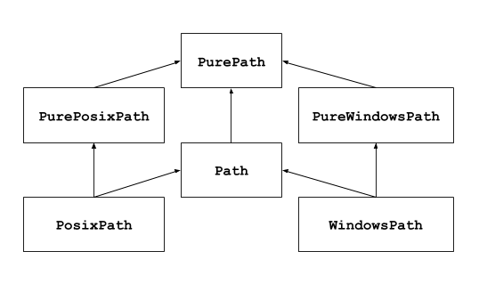

+++
title = "pathlib --- 面向对象的文件系统路径"
date = 2024-11-15T11:53:09+08:00
weight = 1
type = "docs"
description = ""
isCJKLanguage = true
draft = false
+++

> 原文: [https://docs.python.org/zh-cn/3.13/library/pathlib.html](https://docs.python.org/zh-cn/3.13/library/pathlib.html)
>
> 收录该文档的时间：`2024-11-15T11:53:09+08:00`

# `pathlib` --- 面向对象的文件系统路径

> Added in version 3.4.
>

**源代码:** [Lib/pathlib/](https://github.com/python/cpython/tree/3.13/Lib/pathlib/)

------

​	该模块提供表示文件系统路径的类，其语义适用于不同的操作系统。路径类被分为提供纯计算操作而没有 I/O 的 [纯路径](https://docs.python.org/zh-cn/3.13/library/pathlib.html#pure-paths)，以及从纯路径继承而来但提供 I/O 操作的 [具体路径](https://docs.python.org/zh-cn/3.13/library/pathlib.html#concrete-paths)。



​	如果以前从未用过此模块，或不确定哪个类适合完成任务，那要用的可能就是 [`Path`](https://docs.python.org/zh-cn/3.13/library/pathlib.html#pathlib.Path)。它在运行代码的平台上实例化为 [具体路径](https://docs.python.org/zh-cn/3.13/library/pathlib.html#concrete-paths)。

​	在一些用例中纯路径很有用，例如：

1. 如果你想要在 Unix 设备上操作 Windows 路径（或者相反）。你不应在 Unix 上实例化一个 [`WindowsPath`](https://docs.python.org/zh-cn/3.13/library/pathlib.html#pathlib.WindowsPath)，但是你可以实例化 [`PureWindowsPath`](https://docs.python.org/zh-cn/3.13/library/pathlib.html#pathlib.PureWindowsPath)。
2. 你只想操作路径但不想实际访问操作系统。在这种情况下，实例化一个纯路径是有用的，因为它们没有任何访问操作系统的操作。

​	参见

 

[**PEP 428**](https://peps.python.org/pep-0428/)：pathlib 模块 -- 面向对象的文件系统路径。

​	参见

 

​	对于底层的路径字符串操作，你也可以使用 [`os.path`](https://docs.python.org/zh-cn/3.13/library/os.path.html#module-os.path) 模块。

## 基础使用

​	导入主类:


``` python
>>> from pathlib import Path
```

​	列出子目录:


``` python
>>> p = Path('.')
>>> [x for x in p.iterdir() if x.is_dir()]
[PosixPath('.hg'), PosixPath('docs'), PosixPath('dist'),
 PosixPath('__pycache__'), PosixPath('build')]
```

​	列出当前目录树下的所有 Python 源代码文件:


``` python
>>> list(p.glob('**/*.py'))
[PosixPath('test_pathlib.py'), PosixPath('setup.py'),
 PosixPath('pathlib.py'), PosixPath('docs/conf.py'),
 PosixPath('build/lib/pathlib.py')]
```

​	在目录树中移动:


``` python
>>> p = Path('/etc')
>>> q = p / 'init.d' / 'reboot'
>>> q
PosixPath('/etc/init.d/reboot')
>>> q.resolve()
PosixPath('/etc/rc.d/init.d/halt')
```

​	查询路径的属性:


``` python
>>> q.exists()
True
>>> q.is_dir()
False
```

​	打开一个文件:


``` python
>>> with q.open() as f: f.readline()
...
'#!/bin/bash\n'
```

## 异常

## *exception* pathlib.**UnsupportedOperation**

​	一个继承自 [`NotImplementedError`](https://docs.python.org/zh-cn/3.13/library/exceptions.html#NotImplementedError) 的异常，当在路径对象上调用不受支持的操作时它将被引发。

> Added in version 3.13.
>


## 纯路径

​	纯路径对象提供了不实际访问文件系统的路径处理操作。有三种方式来访问这些类，也是不同的风格：

## *class* pathlib.**PurePath**(**pathsegments*)

​	一个通用的类，代表当前系统的路径风格（实例化为 [`PurePosixPath`](https://docs.python.org/zh-cn/3.13/library/pathlib.html#pathlib.PurePosixPath) 或者 [`PureWindowsPath`](https://docs.python.org/zh-cn/3.13/library/pathlib.html#pathlib.PureWindowsPath)）:


``` python
>>> PurePath('setup.py')      # 在 Unix 机器上运行
PurePosixPath('setup.py')
```

*pathsegments* 的每个元素既可以是代表一个路径段的字符串，也可以是实现了 [`os.PathLike`](https://docs.python.org/zh-cn/3.13/library/os.html#os.PathLike) 接口的对象，其中 [`__fspath__()`](https://docs.python.org/zh-cn/3.13/library/os.html#os.PathLike.__fspath__) 方法返回一个字符串，例如另一个路径对象:


``` python
>>> PurePath('foo', 'some/path', 'bar')
PurePosixPath('foo/some/path/bar')
>>> PurePath(Path('foo'), Path('bar'))
PurePosixPath('foo/bar')
```

​	当 *pathsegments* 为空的时候，假定为当前目录:


``` python
>>> PurePath()
PurePosixPath('.')
```

​	如果某个段为绝对路径，则其前面的所有段都会被忽略 (类似 [`os.path.join()`](https://docs.python.org/zh-cn/3.13/library/os.path.html#os.path.join)):


``` python
>>> PurePath('/etc', '/usr', 'lib64')
PurePosixPath('/usr/lib64')
>>> PureWindowsPath('c:/Windows', 'd:bar')
PureWindowsPath('d:bar')
```

​	在 Windows 上，当遇到带根符号的路径段 (如 `r'\foo'`) 时驱动器将不会被重置:


``` python
>>> PureWindowsPath('c:/Windows', '/Program Files')
PureWindowsPath('c:/Program Files')
```

​	假斜杠和单个点号会被消除，但双点号 (`'..'`) 和打头的双斜杠 (`'//'`) 不会，因为这会出于各种原因改变路径的实际含义 (例如符号链接、UNC 路径等):


``` python
>>> PurePath('foo//bar')
PurePosixPath('foo/bar')
>>> PurePath('//foo/bar')
PurePosixPath('//foo/bar')
>>> PurePath('foo/./bar')
PurePosixPath('foo/bar')
>>> PurePath('foo/../bar')
PurePosixPath('foo/../bar')
```

​	（一个很 naïve 的做法是让 `PurePosixPath('foo/../bar')` 等同于 `PurePosixPath('bar')`，如果 `foo` 是一个指向其他目录的符号链接那么这个做法就将出错）

​	纯路径对象实现了 [`os.PathLike`](https://docs.python.org/zh-cn/3.13/library/os.html#os.PathLike) 接口，允许它们在任何接受此接口的地方使用。

*在 3.6 版本发生变更:* 添加了 [`os.PathLike`](https://docs.python.org/zh-cn/3.13/library/os.html#os.PathLike) 接口支持。

## *class* pathlib.**PurePosixPath**(**pathsegments*)

​	一个 [`PurePath`](https://docs.python.org/zh-cn/3.13/library/pathlib.html#pathlib.PurePath) 的子类，路径风格不同于 Windows 文件系统:


``` python
>>> PurePosixPath('/etc/hosts')
PurePosixPath('/etc/hosts')
```

*pathsegments* 参数的指定和 [`PurePath`](https://docs.python.org/zh-cn/3.13/library/pathlib.html#pathlib.PurePath) 相同。

## *class* pathlib.**PureWindowsPath**(**pathsegments*)

[`PurePath`](https://docs.python.org/zh-cn/3.13/library/pathlib.html#pathlib.PurePath) 的一个子类，此路径风格代表 Windows 文件系统路径，包括 [UNC paths](https://en.wikipedia.org/wiki/Path_(computing)#UNC):


``` python
>>> PureWindowsPath('c:/', 'Users', 'Ximénez')
PureWindowsPath('c:/Users/Ximénez')
>>> PureWindowsPath('//server/share/file')
PureWindowsPath('//server/share/file')
```

*pathsegments* 参数的指定和 [`PurePath`](https://docs.python.org/zh-cn/3.13/library/pathlib.html#pathlib.PurePath) 相同。

​	无论你正运行什么系统，你都可以实例化这些类，因为它们提供的操作不做任何系统调用。

### 通用性质

​	路径是不可变并且 [hashable](https://docs.python.org/zh-cn/3.13/glossary.html#term-hashable)。 相同风格的路径可以排序和比较。 这此特性会尊重对应风格的大小写转换语义。:


``` python
>>> PurePosixPath('foo') == PurePosixPath('FOO')
False
>>> PureWindowsPath('foo') == PureWindowsPath('FOO')
True
>>> PureWindowsPath('FOO') in { PureWindowsPath('foo') }
True
>>> PureWindowsPath('C:') < PureWindowsPath('d:')
True
```

​	不同风格的路径比较得到不等的结果并且无法被排序:


``` python
>>> PureWindowsPath('foo') == PurePosixPath('foo')
False
>>> PureWindowsPath('foo') < PurePosixPath('foo')
Traceback (most recent call last):
  File "<stdin>", line 1, in <module>
TypeError: '<' not supported between instances of 'PureWindowsPath' and 'PurePosixPath'
```

### 运算符

​	斜杠操作符可以帮助创建子路径，如 [`os.path.join()`](https://docs.python.org/zh-cn/3.13/library/os.path.html#os.path.join)。 如果参数为一个绝对路径，则之前的路径会被忽略。 在 Windows 上，当参数为一个带根符号的相对路径 (如 `r'\foo'`) 时驱动器将不会被重置:


``` python
>>> p = PurePath('/etc')
>>> p
PurePosixPath('/etc')
>>> p / 'init.d' / 'apache2'
PurePosixPath('/etc/init.d/apache2')
>>> q = PurePath('bin')
>>> '/usr' / q
PurePosixPath('/usr/bin')
>>> p / '/an_absolute_path'
PurePosixPath('/an_absolute_path')
>>> PureWindowsPath('c:/Windows', '/Program Files')
PureWindowsPath('c:/Program Files')
```

​	文件对象可用于任何接受 [`os.PathLike`](https://docs.python.org/zh-cn/3.13/library/os.html#os.PathLike) 接口实现的地方。


``` python
>>> import os
>>> p = PurePath('/etc')
>>> os.fspath(p)
'/etc'
```

​	路径的字符串表示法为它自己原始的文件系统路径（以原生形式，例如在 Windows 下使用反斜杠）。你可以传递给任何需要字符串形式路径的函数。


``` python
>>> p = PurePath('/etc')
>>> str(p)
'/etc'
>>> p = PureWindowsPath('c:/Program Files')
>>> str(p)
'c:\\Program Files'
```

​	类似地，在路径上调用 [`bytes`](https://docs.python.org/zh-cn/3.13/library/stdtypes.html#bytes) 将原始文件系统路径作为字节对象给出，就像被 [`os.fsencode()`](https://docs.python.org/zh-cn/3.13/library/os.html#os.fsencode) 编码一样:


``` python
>>> bytes(p)
b'/etc'
```

​	备注

 

​	只推荐在 Unix 下调用 [`bytes`](https://docs.python.org/zh-cn/3.13/library/stdtypes.html#bytes)。在 Windows， unicode 形式是文件系统路径的规范表示法。

### 访问个别部分

​	为了访问路径独立的部分 （组件），使用以下特征属性：

## PurePath.**parts**

​	一个元组，可以访问路径的多个组件:


``` python
>>> p = PurePath('/usr/bin/python3')
>>> p.parts
('/', 'usr', 'bin', 'python3')

>>> p = PureWindowsPath('c:/Program Files/PSF')
>>> p.parts
('c:\\', 'Program Files', 'PSF')
```

​	（注意盘符和本地根目录是如何重组的）

### 方法和特征属性

​	纯路径提供以下方法和特征属性：

## PurePath.**parser**

​	用于低层级路径解析与合并的 [`os.path`](https://docs.python.org/zh-cn/3.13/library/os.path.html#module-os.path) 模块的实现: `posixpath` 或 `ntpath`。

> Added in version 3.13.
>

## PurePath.**drive**

​	一个表示驱动器盘符或命名的字符串，如果存在:


``` python
>>> PureWindowsPath('c:/Program Files/').drive
'c:'
>>> PureWindowsPath('/Program Files/').drive
''
>>> PurePosixPath('/etc').drive
''
```

​	UNC 分享也被认作驱动器:


``` python
>>> PureWindowsPath('//host/share/foo.txt').drive
'\\\\host\\share'
```

## PurePath.**root**

​	一个表示（本地或全局）根的字符串，如果存在:


``` python
>>> PureWindowsPath('c:/Program Files/').root
'\\'
>>> PureWindowsPath('c:Program Files/').root
''
>>> PurePosixPath('/etc').root
'/'
```

​	UNC 分享一样拥有根:


``` python
>>> PureWindowsPath('//host/share').root
'\\'
```

​	如果路径以超过两个连续斜框打头，[`PurePosixPath`](https://docs.python.org/zh-cn/3.13/library/pathlib.html#pathlib.PurePosixPath) 会合并它们:


``` python
>>> PurePosixPath('//etc').root
'//'
>>> PurePosixPath('///etc').root
'/'
>>> PurePosixPath('////etc').root
'/'
```

​	备注

 

​	此行为符合 *The Open Group Base Specifications Issue 6*, paragraph [4.11 Pathname Resolution](https://pubs.opengroup.org/onlinepubs/009695399/basedefs/xbd_chap04.html#tag_04_11):

*"以连续两个斜杠打头的路径名可能会以具体实现所定义的方式被解读，但是两个以上的前缀斜杠则应当被当作一个斜杠来处理。"*

## PurePath.**anchor**

​	驱动器和根的联合:


``` python
>>> PureWindowsPath('c:/Program Files/').anchor
'c:\\'
>>> PureWindowsPath('c:Program Files/').anchor
'c:'
>>> PurePosixPath('/etc').anchor
'/'
>>> PureWindowsPath('//host/share').anchor
'\\\\host\\share\\'
```

## PurePath.**parents**

​	提供访问此路径的逻辑祖先的不可变序列:


``` python
>>> p = PureWindowsPath('c:/foo/bar/setup.py')
>>> p.parents[0]
PureWindowsPath('c:/foo/bar')
>>> p.parents[1]
PureWindowsPath('c:/foo')
>>> p.parents[2]
PureWindowsPath('c:/')
```

*在 3.10 版本发生变更:* parents 序列现在支持 [切片](https://docs.python.org/zh-cn/3.13/glossary.html#term-slice) 和负的索引值。

## PurePath.**parent**

​	此路径的逻辑父路径:


``` python
>>> p = PurePosixPath('/a/b/c/d')
>>> p.parent
PurePosixPath('/a/b/c')
```

​	你不能超过一个 anchor 或空路径:


``` python
>>> p = PurePosixPath('/')
>>> p.parent
PurePosixPath('/')
>>> p = PurePosixPath('.')
>>> p.parent
PurePosixPath('.')
```

​	备注

 

​	这是一个单纯的词法操作，因此有以下行为:


``` python
>>> p = PurePosixPath('foo/..')
>>> p.parent
PurePosixPath('foo')
```

​	如果你想要向上遍历任意文件系统路径，建议首先调用 [`Path.resolve()`](https://docs.python.org/zh-cn/3.13/library/pathlib.html#pathlib.Path.resolve) 以便解析符号链接并消除 `".."` 部分。

## PurePath.**name**

​	一个表示最后路径组件的字符串，排除了驱动器与根目录，如果存在的话:


``` python
>>> PurePosixPath('my/library/setup.py').name
'setup.py'
```

​	UNC 驱动器名不被考虑:


``` python
>>> PureWindowsPath('//some/share/setup.py').name
'setup.py'
>>> PureWindowsPath('//some/share').name
''
```

## PurePath.**suffix**

​	最后一个路径组件中以点分割的后一部分（如果有）


``` python
>>> PurePosixPath('my/library/setup.py').suffix
'.py'
>>> PurePosixPath('my/library.tar.gz').suffix
'.gz'
>>> PurePosixPath('my/library').suffix
''
```

​	这通常被称作文件扩展名。

## PurePath.**suffixes**

​	由路径后缀组成的列表，经常被称作文件扩展名:


``` python
>>> PurePosixPath('my/library.tar.gar').suffixes
['.tar', '.gar']
>>> PurePosixPath('my/library.tar.gz').suffixes
['.tar', '.gz']
>>> PurePosixPath('my/library').suffixes
[]
```

## PurePath.**stem**

​	最后一个路径组件，除去后缀:


``` python
>>> PurePosixPath('my/library.tar.gz').stem
'library.tar'
>>> PurePosixPath('my/library.tar').stem
'library'
>>> PurePosixPath('my/library').stem
'library'
```

## PurePath.**as_posix**()

​	返回使用正斜杠（`/`）的路径字符串:


``` python
>>> p = PureWindowsPath('c:\\windows')
>>> str(p)
'c:\\windows'
>>> p.as_posix()
'c:/windows'
```

## PurePath.**is_absolute**()

​	返回此路径是否为绝对路径。如果路径同时拥有驱动器符与根路径（如果风格允许）则将被认作绝对路径。


``` python
>>> PurePosixPath('/a/b').is_absolute()
True
>>> PurePosixPath('a/b').is_absolute()
False

>>> PureWindowsPath('c:/a/b').is_absolute()
True
>>> PureWindowsPath('/a/b').is_absolute()
False
>>> PureWindowsPath('c:').is_absolute()
False
>>> PureWindowsPath('//some/share').is_absolute()
True
```

## PurePath.**is_relative_to**(*other*)

​	返回此路径是否相对于 *other* 的路径。


``` python
>>> p = PurePath('/etc/passwd')
>>> p.is_relative_to('/etc')
True
>>> p.is_relative_to('/usr')
False
```

​	此方法是基于字符串的；它不会访问文件系统也不会对 "`..`" 部分进行特殊处理。 以下代码是等价的：


``` python
>>> u = PurePath('/usr')
>>> u == p or u in p.parents
False
```

> Added in version 3.9.
>

*Deprecated since version 3.12, will be removed in version 3.14:* 传入附加参数的做法已被弃用；如果提供了附加参数，它们将与 *other* 合并。

## PurePath.**is_reserved**()

​	在 [`PureWindowsPath`](https://docs.python.org/zh-cn/3.13/library/pathlib.html#pathlib.PureWindowsPath)，如果路径是被 Windows 保留的则返回 `True`，否则 `False`。在 [`PurePosixPath`](https://docs.python.org/zh-cn/3.13/library/pathlib.html#pathlib.PurePosixPath)，总是返回 `False`。

*在 3.13 版本发生变更:* Windows 的含有一个冒号或以点或空格结尾的路径名是被认为是被保留的。 UNC 路径也可能被保留。

*Deprecated since version 3.13, will be removed in version 3.15:* 此方法已被弃用；使用 [`os.path.isreserved()`](https://docs.python.org/zh-cn/3.13/library/os.path.html#os.path.isreserved) 以鉴别在 Windows 下的保留路径。

## PurePath.**joinpath**(**pathsegments*)

​	调用此方法等同于依次将路径与给定的每个 *pathsegments* 组合到一起:


``` python
>>> PurePosixPath('/etc').joinpath('passwd')
PurePosixPath('/etc/passwd')
>>> PurePosixPath('/etc').joinpath(PurePosixPath('passwd'))
PurePosixPath('/etc/passwd')
>>> PurePosixPath('/etc').joinpath('init.d', 'apache2')
PurePosixPath('/etc/init.d/apache2')
>>> PureWindowsPath('c:').joinpath('/Program Files')
PureWindowsPath('c:/Program Files')
```

## PurePath.**full_match**(*pattern*, ***, *case_sensitive=None*)

​	将此路径与所提供的 glob 样式匹配。如果匹配成功，则返回``True``，否则返回``False``。例如:


``` python
>>> PurePath('a/b.py').full_match('a/*.py')
True
>>> PurePath('a/b.py').full_match('*.py')
False
>>> PurePath('/a/b/c.py').full_match('/a/**')
True
>>> PurePath('/a/b/c.py').full_match('**/*.py')
True
```

​	参见

 

[模式语言](https://docs.python.org/zh-cn/3.13/library/pathlib.html#pathlib-pattern-language) 文档。

​	与其他方法一样，是否大小写敏感遵循平台的默认规则:


``` python
>>> PurePosixPath('b.py').full_match('*.PY')
False
>>> PureWindowsPath('b.py').full_match('*.PY')
True
```

​	将 *case_sensitive* 设为 `True` 或 `False` 来覆盖此行为。

> Added in version 3.13.
>

## PurePath.**match**(*pattern*, ***, *case_sensitive=None*)

​	将此路径与所提供的非递归 glob 样式匹配。如果匹配成功，则返回``True``，否则返回``False``。

​	此方法与 [`full_match()`](https://docs.python.org/zh-cn/3.13/library/pathlib.html#pathlib.PurePath.full_match) 类似，但不允许空模式 (将引发 [`ValueError`](https://docs.python.org/zh-cn/3.13/library/exceptions.html#ValueError))，也不支持递归通配符 "`**`" (将视为非递归的 "`*`")，并且如果提供了一个相对格式，则将从右开始匹配:


``` python
>>> PurePath('a/b.py').match('*.py')
True
>>> PurePath('/a/b/c.py').match('b/*.py')
True
>>> PurePath('/a/b/c.py').match('a/*.py')
False
```

*在 3.12 版本发生变更:* *pattern* 形参接受一个 [path-like object](https://docs.python.org/zh-cn/3.13/glossary.html#term-path-like-object)。

*在 3.12 版本发生变更:* 增加了 *case_sensitive* 形参。

## PurePath.**relative_to**(*other*, *walk_up=False*)

​	计算此路径相对于 *other* 所表示路径的版本。 如果不可计算，则引发 [`ValueError`](https://docs.python.org/zh-cn/3.13/library/exceptions.html#ValueError):


``` python
>>> p = PurePosixPath('/etc/passwd')
>>> p.relative_to('/')
PurePosixPath('etc/passwd')
>>> p.relative_to('/etc')
PurePosixPath('passwd')
>>> p.relative_to('/usr')
Traceback (most recent call last):
  File "<stdin>", line 1, in <module>
  File "pathlib.py", line 941, in relative_to
    raise ValueError(error_message.format(str(self), str(formatted)))
ValueError: '/etc/passwd' is not in the subpath of '/usr' OR one path is relative and the other is absolute.
```

​	当 *walk_up* 为（默认的）假值时，路径必须以 *other* 开始。 当参数为真值时，可能会添加 `..` 条目以形成相对路径。 在所有其他情况下，例如路径引用了不同的驱动器，则会引发 [`ValueError`](https://docs.python.org/zh-cn/3.13/library/exceptions.html#ValueError)。:


``` python
>>> p.relative_to('/usr', walk_up=True)
PurePosixPath('../etc/passwd')
>>> p.relative_to('foo', walk_up=True)
Traceback (most recent call last):
  File "<stdin>", line 1, in <module>
  File "pathlib.py", line 941, in relative_to
    raise ValueError(error_message.format(str(self), str(formatted)))
ValueError: '/etc/passwd' is not on the same drive as 'foo' OR one path is relative and the other is absolute.
```

​	警告

 

​	该函数是 [`PurePath`](https://docs.python.org/zh-cn/3.13/library/pathlib.html#pathlib.PurePath) 的一部分并适用于字符串。 它不会检查或访问下层的文件结构体。 这可能会影响 *walk_up* 选项因为它假定路径中不存在符号链接；如果需要处理符号链接请先调用 [`resolve()`](https://docs.python.org/zh-cn/3.13/library/pathlib.html#pathlib.Path.resolve)。

*在 3.12 版本发生变更:* 增加了 *walk_up* 形参数（原本的行为与 `walk_up=False` 相同）。

*Deprecated since version 3.12, will be removed in version 3.14:* 传入附加位置参数的做法已被弃用；如果提供的话，它们将与 *other* 合并。

## PurePath.**with_name**(*name*)

​	返回一个新的路径并修改 [`name`](https://docs.python.org/zh-cn/3.13/library/pathlib.html#pathlib.PurePath.name)。如果原本路径没有 name，ValueError 被抛出:


``` python
>>> p = PureWindowsPath('c:/Downloads/pathlib.tar.gz')
>>> p.with_name('setup.py')
PureWindowsPath('c:/Downloads/setup.py')
>>> p = PureWindowsPath('c:/')
>>> p.with_name('setup.py')
Traceback (most recent call last):
  File "<stdin>", line 1, in <module>
  File "/home/antoine/cpython/default/Lib/pathlib.py", line 751, in with_name
    raise ValueError("%r has an empty name" % (self,))
ValueError: PureWindowsPath('c:/') has an empty name
```

## PurePath.**with_stem**(*stem*)

​	返回一个带有修改后 [`stem`](https://docs.python.org/zh-cn/3.13/library/pathlib.html#pathlib.PurePath.stem) 的新路径。 如果原路径没有名称，则会引发 ValueError:


``` python
>>> p = PureWindowsPath('c:/Downloads/draft.txt')
>>> p.with_stem('final')
PureWindowsPath('c:/Downloads/final.txt')
>>> p = PureWindowsPath('c:/Downloads/pathlib.tar.gz')
>>> p.with_stem('lib')
PureWindowsPath('c:/Downloads/lib.gz')
>>> p = PureWindowsPath('c:/')
>>> p.with_stem('')
Traceback (most recent call last):
  File "<stdin>", line 1, in <module>
  File "/home/antoine/cpython/default/Lib/pathlib.py", line 861, in with_stem
    return self.with_name(stem + self.suffix)
  File "/home/antoine/cpython/default/Lib/pathlib.py", line 851, in with_name
    raise ValueError("%r has an empty name" % (self,))
ValueError: PureWindowsPath('c:/') has an empty name
```

> Added in version 3.9.
>

## PurePath.**with_suffix**(*suffix*)

​	返回一个新的路径并修改 [`suffix`](https://docs.python.org/zh-cn/3.13/library/pathlib.html#pathlib.PurePath.suffix)。如果原本的路径没有后缀，新的 *suffix* 则被追加以代替。如果 *suffix* 是空字符串，则原本的后缀被移除:


``` python
>>> p = PureWindowsPath('c:/Downloads/pathlib.tar.gz')
>>> p.with_suffix('.bz2')
PureWindowsPath('c:/Downloads/pathlib.tar.bz2')
>>> p = PureWindowsPath('README')
>>> p.with_suffix('.txt')
PureWindowsPath('README.txt')
>>> p = PureWindowsPath('README.txt')
>>> p.with_suffix('')
PureWindowsPath('README')
```

## PurePath.**with_segments**(**pathsegments*)

​	通过组合给定的 *pathsegments* 创建一个相同类型的新路径对象。 每当创建派生路径，如从 [`parent`](https://docs.python.org/zh-cn/3.13/library/pathlib.html#pathlib.PurePath.parent) 和 [`relative_to()`](https://docs.python.org/zh-cn/3.13/library/pathlib.html#pathlib.PurePath.relative_to) 创建时都会调用此方法。 子类可以覆盖此方法以便向派生路径传递信息，例如:

```
from pathlib import PurePosixPath

class MyPath(PurePosixPath):
    def __init__(self, *pathsegments, session_id):
        super().__init__(*pathsegments)
        self.session_id = session_id

    def with_segments(self, *pathsegments):
        return type(self)(*pathsegments, session_id=self.session_id)

etc = MyPath('/etc', session_id=42)
hosts = etc / 'hosts'
print(hosts.session_id)  # 42
```

> Added in version 3.12.
>


## 具体路径

​	具体路径是纯路径的子类。除了后者提供的操作之外，它们还提供了对路径对象进行系统调用的方法。有三种方法可以实例化具体路径:

## *class* pathlib.**Path**(**pathsegments*)

​	一个 [`PurePath`](https://docs.python.org/zh-cn/3.13/library/pathlib.html#pathlib.PurePath) 的子类，此类以当前系统的路径风格表示路径（实例化为 [`PosixPath`](https://docs.python.org/zh-cn/3.13/library/pathlib.html#pathlib.PosixPath) 或 [`WindowsPath`](https://docs.python.org/zh-cn/3.13/library/pathlib.html#pathlib.WindowsPath)）:


``` python
>>> Path('setup.py')
PosixPath('setup.py')
```

*pathsegments* 参数的指定和 [`PurePath`](https://docs.python.org/zh-cn/3.13/library/pathlib.html#pathlib.PurePath) 相同。

## *class* pathlib.**PosixPath**(**pathsegments*)

​	一个 [`Path`](https://docs.python.org/zh-cn/3.13/library/pathlib.html#pathlib.Path) 和 [`PurePosixPath`](https://docs.python.org/zh-cn/3.13/library/pathlib.html#pathlib.PurePosixPath) 的子类，此类表示一个非 Windows 文件系统的具体路径:


``` python
>>> PosixPath('/etc/hosts')
PosixPath('/etc/hosts')
```

*pathsegments* 参数的指定和 [`PurePath`](https://docs.python.org/zh-cn/3.13/library/pathlib.html#pathlib.PurePath) 相同。

*在 3.13 版本发生变更:* 在 Windows 上引发 [`UnsupportedOperation`](https://docs.python.org/zh-cn/3.13/library/pathlib.html#pathlib.UnsupportedOperation)。 在之前版本中，则为引发 [`NotImplementedError`](https://docs.python.org/zh-cn/3.13/library/exceptions.html#NotImplementedError)。

## *class* pathlib.**WindowsPath**(**pathsegments*)

[`Path`](https://docs.python.org/zh-cn/3.13/library/pathlib.html#pathlib.Path) 和 [`PureWindowsPath`](https://docs.python.org/zh-cn/3.13/library/pathlib.html#pathlib.PureWindowsPath) 的子类，从类表示一个 Windows 文件系统的具体路径:


``` python
>>> WindowsPath('c:/', 'Users', 'Ximénez')
WindowsPath('c:/Users/Ximénez')
```

*pathsegments* 参数的指定和 [`PurePath`](https://docs.python.org/zh-cn/3.13/library/pathlib.html#pathlib.PurePath) 相同。

*在 3.13 版本发生变更:* 在非 Windows 平台上引发 [`UnsupportedOperation`](https://docs.python.org/zh-cn/3.13/library/pathlib.html#pathlib.UnsupportedOperation)。 在之前版本中，则为引发 [`NotImplementedError`](https://docs.python.org/zh-cn/3.13/library/exceptions.html#NotImplementedError)。

​	你只能实例化与当前系统风格相同的类（允许系统调用作用于不兼容的路径风格可能在应用程序中导致缺陷或失败）:


``` python
>>> import os
>>> os.name
'posix'
>>> Path('setup.py')
PosixPath('setup.py')
>>> PosixPath('setup.py')
PosixPath('setup.py')
>>> WindowsPath('setup.py')
Traceback (most recent call last):
  File "<stdin>", line 1, in <module>
  File "pathlib.py", line 798, in __new__
    % (cls.__name__,))
UnsupportedOperation: cannot instantiate 'WindowsPath' on your system
```

​	某些具体路径方法在一个系统调用失败时（例如由于路径不存在）可能引发 [`OSError`](https://docs.python.org/zh-cn/3.13/library/exceptions.html#OSError)。

### 解析和生成 URI

​	具体路径对象可基于符合 [**RFC 8089**](https://datatracker.ietf.org/doc/html/rfc8089.html) 的 '文件' URI 来创建，并可用它来表示。

​	备注

 

​	文件 URI 不能在具有不同 [文件系统编码格式](https://docs.python.org/zh-cn/3.13/library/os.html#filesystem-encoding) 的机器之间进行移植。

## *classmethod* Path.**from_uri**(*uri*)

​	通过解析一个 '文件' URI 来返回新的路径对象。 例如:


``` python
>>> p = Path.from_uri('file:///etc/hosts')
PosixPath('/etc/hosts')
```

​	在 Windows 上，可以基于 URI 来解析 DOS 设备和 UNC 路径:


``` python
>>> p = Path.from_uri('file:///c:/windows')
WindowsPath('c:/windows')
>>> p = Path.from_uri('file://server/share')
WindowsPath('//server/share')
```

​	某些变化形式也是受支持的:


``` python
>>> p = Path.from_uri('file:////server/share')
WindowsPath('//server/share')
>>> p = Path.from_uri('file://///server/share')
WindowsPath('//server/share')
>>> p = Path.from_uri('file:c:/windows')
WindowsPath('c:/windows')
>>> p = Path.from_uri('file:/c|/windows')
WindowsPath('c:/windows')
```

​	如果 URI 不是以 `file:` 开头，或者被解析的不是绝对路径则会引发 [`ValueError`](https://docs.python.org/zh-cn/3.13/library/exceptions.html#ValueError)。

> Added in version 3.13.
>

## Path.**as_uri**()

​	将路径表示为 'file' URI。 如果路径不是绝对路径则会引发 [`ValueError`](https://docs.python.org/zh-cn/3.13/library/exceptions.html#ValueError)。


``` python
>>> p = PosixPath('/etc/passwd')
>>> p.as_uri()
'file:///etc/passwd'
>>> p = WindowsPath('c:/Windows')
>>> p.as_uri()
'file:///c:/Windows'
```

​	出于历史原因，该方法在 [`PurePath`](https://docs.python.org/zh-cn/3.13/library/pathlib.html#pathlib.PurePath) 对象中也可用。 不过，由于它使用了 [`os.fsencode()`](https://docs.python.org/zh-cn/3.13/library/os.html#os.fsencode) 因此严格来说并不纯净。

### 扩展和计算路径

## *classmethod* Path.**home**()

​	返回一个表示用户家目录的新路径对象（与带 `~` 构造的 [`os.path.expanduser()`](https://docs.python.org/zh-cn/3.13/library/os.path.html#os.path.expanduser) 所返回的相同）。 如果无法解析家目录，则会引发 [`RuntimeError`](https://docs.python.org/zh-cn/3.13/library/exceptions.html#RuntimeError)。


``` python
>>> Path.home()
PosixPath('/home/antoine')
```

> Added in version 3.5.
>

## Path.**expanduser**()

​	返回带有扩展 `~` 和 `~user` 构造的新路径，与 [`os.path.expanduser()`](https://docs.python.org/zh-cn/3.13/library/os.path.html#os.path.expanduser) 所返回的相同。 如果无法解析家目录，则会引发 [`RuntimeError`](https://docs.python.org/zh-cn/3.13/library/exceptions.html#RuntimeError)。


``` python
>>> p = PosixPath('~/films/Monty Python')
>>> p.expanduser()
PosixPath('/home/eric/films/Monty Python')
```

> Added in version 3.5.
>

## *classmethod* Path.**cwd**()

​	返回一个新的表示当前目录的路径对象（和 [`os.getcwd()`](https://docs.python.org/zh-cn/3.13/library/os.html#os.getcwd) 返回的相同）:


``` python
>>> Path.cwd()
PosixPath('/home/antoine/pathlib')
```

## Path.**absolute**()

​	改为绝对路径，不会执行正规化或解析符号链接。 返回一个新的路径对象:


``` python
>>> p = Path('tests')
>>> p
PosixPath('tests')
>>> p.absolute()
PosixPath('/home/antoine/pathlib/tests')
```

## Path.**resolve**(*strict=False*)

​	将路径绝对化，解析任何符号链接。返回新的路径对象:


``` python
>>> p = Path()
>>> p
PosixPath('.')
>>> p.resolve()
PosixPath('/home/antoine/pathlib')
```

​	"`..`" 组件也将被消除（只有这一种方法这么做）:


``` python
>>> p = Path('docs/../setup.py')
>>> p.resolve()
PosixPath('/home/antoine/pathlib/setup.py')
```

​	如果一个路径不存在或是遇到了符号链接循环，并且 *strict* 为 `True`，则会引发 [`OSError`](https://docs.python.org/zh-cn/3.13/library/exceptions.html#OSError)。 如果 *strict* 为 `False`，则会尽可能地解析路径并添加任何剩余部分而不会检查其是否存在。

*在 3.6 版本发生变更:* 增加了 *strict* 参数（3.6 之前的行为是默认采用 strict 模式）。

*在 3.13 版本发生变更:* 符号链接循环将像其他错误一样处理：在严格模式下会引发 [`OSError`](https://docs.python.org/zh-cn/3.13/library/exceptions.html#OSError)，而在非严格模式下不会引发异常。 在之前版本中，无论 *strict* 的值是什么都会引发 [`RuntimeError`](https://docs.python.org/zh-cn/3.13/library/exceptions.html#RuntimeError)。

## Path.**readlink**()

​	返回符号链接所指向的路径（即 [`os.readlink()`](https://docs.python.org/zh-cn/3.13/library/os.html#os.readlink) 的返回值）:


``` python
>>> p = Path('mylink')
>>> p.symlink_to('setup.py')
>>> p.readlink()
PosixPath('setup.py')
```

> Added in version 3.9.
>

*在 3.13 版本发生变更:* 如果 [`os.readlink()`](https://docs.python.org/zh-cn/3.13/library/os.html#os.readlink) 不可用则会引发 [`UnsupportedOperation`](https://docs.python.org/zh-cn/3.13/library/pathlib.html#pathlib.UnsupportedOperation)。 在之前版本中，则是引发 [`NotImplementedError`](https://docs.python.org/zh-cn/3.13/library/exceptions.html#NotImplementedError)。

### 查询文件类型和状态

*在 3.8 版本发生变更:* 现在对于包含在 OS 层级上无法表示的字符的路径 [`exists()`](https://docs.python.org/zh-cn/3.13/library/pathlib.html#pathlib.Path.exists), [`is_dir()`](https://docs.python.org/zh-cn/3.13/library/pathlib.html#pathlib.Path.is_dir), [`is_file()`](https://docs.python.org/zh-cn/3.13/library/pathlib.html#pathlib.Path.is_file), [`is_mount()`](https://docs.python.org/zh-cn/3.13/library/pathlib.html#pathlib.Path.is_mount), [`is_symlink()`](https://docs.python.org/zh-cn/3.13/library/pathlib.html#pathlib.Path.is_symlink), [`is_block_device()`](https://docs.python.org/zh-cn/3.13/library/pathlib.html#pathlib.Path.is_block_device), [`is_char_device()`](https://docs.python.org/zh-cn/3.13/library/pathlib.html#pathlib.Path.is_char_device), [`is_fifo()`](https://docs.python.org/zh-cn/3.13/library/pathlib.html#pathlib.Path.is_fifo), [`is_socket()`](https://docs.python.org/zh-cn/3.13/library/pathlib.html#pathlib.Path.is_socket) 将返回 `False` 而不是引发异常。

## Path.**stat**(***, *follow_symlinks=True*)

​	返回一个 [`os.stat_result`](https://docs.python.org/zh-cn/3.13/library/os.html#os.stat_result) 对象，其中包含有关此路径的信息，就像 [`os.stat()`](https://docs.python.org/zh-cn/3.13/library/os.html#os.stat)。 结果会在每次调用此方法时被查找。

​	此方法通常会跟随符号链接；要对 symlink 使用 stat 请添加参数 `follow_symlinks=False`，或者使用 [`lstat()`](https://docs.python.org/zh-cn/3.13/library/pathlib.html#pathlib.Path.lstat)。


``` python
>>> p = Path('setup.py')
>>> p.stat().st_size
956
>>> p.stat().st_mtime
1327883547.852554
```

*在 3.10 版本发生变更:* 增加了 *follow_symlinks* 形参。

## Path.**lstat**()

​	就和 [`Path.stat()`](https://docs.python.org/zh-cn/3.13/library/pathlib.html#pathlib.Path.stat) 一样，但是如果路径指向符号链接，则是返回符号链接而不是目标的信息。

## Path.**exists**(***, *follow_symlinks=True*)

​	如果路径指向现有的文件或目录则返回 `True`。

​	此方法通常会跟随符号链接；要检查符号链接是否存在，请添加参数 `follow_symlinks=False`。


``` python
>>> Path('.').exists()
True
>>> Path('setup.py').exists()
True
>>> Path('/etc').exists()
True
>>> Path('nonexistentfile').exists()
False
```

*在 3.12 版本发生变更:* 增加了 *follow_symlinks* 形参。

## Path.**is_file**(***, *follow_symlinks=True*)

​	如果路径指向一个常规文件则返回 `True`，如果是指向其他种类的文件则返回 `False`。

​	当路径不存在或者是一个破损的符号链接时也会返回 `False`；其他错误（例如权限错误）被传播。

​	此方法通常会跟随符号链接；要排除符号链接，请添加参数 `follow_symlinks=False`。

*在 3.13 版本发生变更:* 增加了 *follow_symlinks* 形参。

## Path.**is_dir**(***, *follow_symlinks=True*)

​	如果路径指向一个目录则返回 `True`，如果是指向其他种类的文件则返回 `False`。

​	当路径不存在或者是一个破损的符号链接时也会返回 `False`；其他错误（例如权限错误）被传播。

​	此方法通常会跟随符号链接；要排除指向目录的符号链接，请添加参数 `follow_symlinks=False`。

*在 3.13 版本发生变更:* 增加了 *follow_symlinks* 形参。

## Path.**is_symlink**()

​	如果路径指向符号链接则返回 `True`， 否则 `False`。

​	如果路径不存在也返回 `False`；其他错误（例如权限错误）被传播。

## Path.**is_junction**()

​	如果路径是指向一个接合点则返回 `True`，如果是其他文件类型则返回 `False`。 目前只有 Windows 支持接合点。

> Added in version 3.12.
>

## Path.**is_mount**()

​	如果路径是一个 *挂载点*: 在文件系统中被其他不同文件系统挂载的位置则返回 `True`。 在 POSIX 上，此函数将检查 *path* 的上一级 `path/..` 是否位于和 *path* 不同的设备中，或者 `path/..` 和 *path* 是否指向位于相同设置的相同 i-node --- 这应当能检测所有 Unix 和 POSIX 变种上的挂载点。 在 Windows 上，挂载点是被视为驱动器盘符的根目录 (例如 `c:\`)、UNC 共享目录 (例如 `\\server\share`) 或已挂载的文件系统目录。

> Added in version 3.7.
>

*在 3.12 版本发生变更:* 添加了 Windows 支持。

## Path.**is_socket**()

​	如果路径指向一个 Unix socket 文件（或者指向 Unix socket 文件的符号链接）则返回 `True`，如果指向其他类型的文件则返回 `False`。

​	当路径不存在或者是一个破损的符号链接时也会返回 `False`；其他错误（例如权限错误）被传播。

## Path.**is_fifo**()

​	如果路径指向一个先进先出存储（或者指向先进先出存储的符号链接）则返回 `True` ，指向其他类型的文件则返回 `False`。

​	当路径不存在或者是一个破损的符号链接时也会返回 `False`；其他错误（例如权限错误）被传播。

## Path.**is_block_device**()

​	如果文件指向一个块设备（或者指向块设备的符号链接）则返回 `True`，指向其他类型的文件则返回 `False`。

​	当路径不存在或者是一个破损的符号链接时也会返回 `False`；其他错误（例如权限错误）被传播。

## Path.**is_char_device**()

​	如果路径指向一个字符设备（或指向字符设备的符号链接）则返回 `True`，指向其他类型的文件则返回 `False`。

​	当路径不存在或者是一个破损的符号链接时也会返回 `False`；其他错误（例如权限错误）被传播。

## Path.**samefile**(*other_path*)

​	返回此目录是否指向与可能是字符串或者另一个路径对象的 *other_path* 相同的文件。语义类似于 [`os.path.samefile()`](https://docs.python.org/zh-cn/3.13/library/os.path.html#os.path.samefile) 与 [`os.path.samestat()`](https://docs.python.org/zh-cn/3.13/library/os.path.html#os.path.samestat)。

​	如果两者都以同一原因无法访问，则抛出 [`OSError`](https://docs.python.org/zh-cn/3.13/library/exceptions.html#OSError)。


``` python
>>> p = Path('spam')
>>> q = Path('eggs')
>>> p.samefile(q)
False
>>> p.samefile('spam')
True
```

> Added in version 3.5.
>

### 读写文件

## Path.**open**(*mode='r'*, *buffering=-1*, *encoding=None*, *errors=None*, *newline=None*)

​	打开路径指向的文件，就像内置的 [`open()`](https://docs.python.org/zh-cn/3.13/library/functions.html#open) 函数所做的一样:


``` python
>>> p = Path('setup.py')
>>> with p.open() as f:
...     f.readline()
...
'#!/usr/bin/env python3\n'
```

## Path.**read_text**(*encoding=None*, *errors=None*, *newline=None*)

​	以字符串形式返回路径指向的文件的解码后文本内容。


``` python
>>> p = Path('my_text_file')
>>> p.write_text('Text file contents')
18
>>> p.read_text()
'Text file contents'
```

​	文件先被打开然后关闭。有和 [`open()`](https://docs.python.org/zh-cn/3.13/library/functions.html#open) 一样的可选形参。

> Added in version 3.5.
>

*在 3.13 版本发生变更:* 增加了 *newline* 形参。

## Path.**read_bytes**()

​	以字节对象的形式返回路径指向的文件的二进制内容:


``` python
>>> p = Path('my_binary_file')
>>> p.write_bytes(b'Binary file contents')
20
>>> p.read_bytes()
b'Binary file contents'
```

> Added in version 3.5.
>

## Path.**write_text**(*data*, *encoding=None*, *errors=None*, *newline=None*)

​	将文件以文本模式打开，写入 *data* 并关闭:


``` python
>>> p = Path('my_text_file')
>>> p.write_text('Text file contents')
18
>>> p.read_text()
'Text file contents'
```

​	同名的现有文件会被覆盖。 可选形参的含义与 [`open()`](https://docs.python.org/zh-cn/3.13/library/functions.html#open) 的相同。

> Added in version 3.5.
>

*在 3.10 版本发生变更:* 增加了 *newline* 形参。

## Path.**write_bytes**(*data*)

​	将文件以二进制模式打开，写入 *data* 并关闭:


``` python
>>> p = Path('my_binary_file')
>>> p.write_bytes(b'Binary file contents')
20
>>> p.read_bytes()
b'Binary file contents'
```

​	一个同名的现存文件将被覆盖。

> Added in version 3.5.
>

### 读取目录

## Path.**iterdir**()

​	当路径指向一个目录时，产生该路径下的对象的路径:


``` python
>>> p = Path('docs')
>>> for child in p.iterdir(): child
...
PosixPath('docs/conf.py')
PosixPath('docs/_templates')
PosixPath('docs/make.bat')
PosixPath('docs/index.rst')
PosixPath('docs/_build')
PosixPath('docs/_static')
PosixPath('docs/Makefile')
```

​	子条目会以任意顺序产生，并且不包括特殊条目 `'.'` 和 `'..'`。 如果迭代器创建之后有文件在目录中被移除或添加，是否要包括该文件所对应的路径对象并没有明确规定。

​	如果该路径不是一个目录或是无法访问，则会引发 [`OSError`](https://docs.python.org/zh-cn/3.13/library/exceptions.html#OSError)。

## Path.**glob**(*pattern*, ***, *case_sensitive=None*, *recurse_symlinks=False*)

​	解析相对于此路径的通配符 *pattern*，产生所有匹配的文件:


``` python
>>> sorted(Path('.').glob('*.py'))
[PosixPath('pathlib.py'), PosixPath('setup.py'), PosixPath('test_pathlib.py')]
>>> sorted(Path('.').glob('*/*.py'))
[PosixPath('docs/conf.py')]
>>> sorted(Path('.').glob('**/*.py'))
[PosixPath('build/lib/pathlib.py'),
 PosixPath('docs/conf.py'),
 PosixPath('pathlib.py'),
 PosixPath('setup.py'),
 PosixPath('test_pathlib.py')]
```

​	参见

 

[模式语言](https://docs.python.org/zh-cn/3.13/library/pathlib.html#pathlib-pattern-language) 文档。

​	在默认情况下，或当 *case_sensitive* 关键字参数被设为 `None` 时，该方法将使用特定平台的大小写规则匹配路径：通常，在 POSIX 上区分大小写，而在 Windows 上不区分大小写。将 *case_sensitive* 设为 `True` 或 `False` 可覆盖此行为。

​	在默认情况下，或是当 *recurse_symlinks* 关键字参数被设为 `False` 时，此方法将跟随符号链接但在扩展 "`**`" 通配符时除外。 将 *recurse_symlinks* 设为 `True` 将总是跟随符号链接。

​	引发一个 [审计事件](https://docs.python.org/zh-cn/3.13/library/sys.html#auditing) `pathlib.Path.glob` 并附带参数 `self`, `pattern`。

*在 3.12 版本发生变更:* 增加了 *case_sensitive* 形参。

*在 3.13 版本发生变更:* 增加了 *recurse_symlinks* 形参。

*在 3.13 版本发生变更:* *pattern* 形参接受一个 [path-like object](https://docs.python.org/zh-cn/3.13/glossary.html#term-path-like-object)。

*在 3.13 版本发生变更:* 任何因扫描文件系统而引发的 [`OSError`](https://docs.python.org/zh-cn/3.13/library/exceptions.html#OSError) 异常都会被抑制。 在之前的版本中，此类异常在许多情况下都会被抑制，但并非全部情况。

## Path.**rglob**(*pattern*, ***, *case_sensitive=None*, *recurse_symlinks=False*)

​	递归地对给定的相对 *pattern* 执行 glob 通配。 这类似于调用 [`Path.glob()`](https://docs.python.org/zh-cn/3.13/library/pathlib.html#pathlib.Path.glob) 时在 *pattern* 之前加上 "`**/`"。

​	参见

 

[模式语言](https://docs.python.org/zh-cn/3.13/library/pathlib.html#pathlib-pattern-language) 和 [`Path.glob()`](https://docs.python.org/zh-cn/3.13/library/pathlib.html#pathlib.Path.glob) 文档。

​	引发一个 [审计事件](https://docs.python.org/zh-cn/3.13/library/sys.html#auditing) `pathlib.Path.rglob` 并附带参数 `self`, `pattern`。

*在 3.12 版本发生变更:* 增加了 *case_sensitive* 形参。

*在 3.13 版本发生变更:* 增加了 *recurse_symlinks* 形参。

*在 3.13 版本发生变更:* *pattern* 形参接受一个 [path-like object](https://docs.python.org/zh-cn/3.13/glossary.html#term-path-like-object)。

## Path.**walk**(*top_down=True*, *on_error=None*, *follow_symlinks=False*)

​	通过对目录树自上而下或自下而上的遍历来生成其中的文件名。

​	对于根位置为 *self* 的目录树中的每个目录（包括 *self* 但不包括 '.' 和 '..'），该方法会产生一个 3 元组 `(dirpath, dirnames, filenames)`。

*dirpath* 是指向当前正被遍历到的目录的 [`Path`](https://docs.python.org/zh-cn/3.13/library/pathlib.html#pathlib.Path)，*dirnames* 是由表示 *dirpath* 中子目录名称的字符串组成的列表 (不包括 `'.'` 和 `'..'`)，*filenames* 是由表示 *dirpath* 中非目录文件名称的字符串组成的列表。 要获取 *dirpath* 中文件或目录的完整路径 (以 *self* 开头)，可使用 `dirpath / name`。 这些列表是否排序取决于具体的文件系统。

​	如果可选参数 *top_down* 为（默认的）真值，则会在所有子目录的三元组生成之前生成父目录的三元组（目录是自上而下遍历的）。 如果 *top_down* 为假值，则会在所有子目录的三元组生成之后再生成父目录的三元组（目录是是自下而上遍历的）。无论 *top_down* 的值是什么，都会在遍历目录及其子目录的三元组之前提取子目录列表。

​	当 *top_down* 为真值时，调用方可以原地修改 *dirnames* 列表（例如，使用 [`del`](https://docs.python.org/zh-cn/3.13/reference/simple_stmts.html#del) 或切片赋值），而 [`Path.walk()`](https://docs.python.org/zh-cn/3.13/library/pathlib.html#pathlib.Path.walk) 只会向名称保留在 *dirnames* 中的子目录递归。 这可被用于搜索剪枝，或强制应用特定的访问顺序，或者甚至是在重新恢复执行 [`Path.walk()`](https://docs.python.org/zh-cn/3.13/library/pathlib.html#pathlib.Path.walk) 之前告知 [`Path.walk()`](https://docs.python.org/zh-cn/3.13/library/pathlib.html#pathlib.Path.walk) 调用方所创建或重命名的目录。 当 *top_down* 为假值时修改 *dirnames* 不会对 [`Path.walk()`](https://docs.python.org/zh-cn/3.13/library/pathlib.html#pathlib.Path.walk) 的的行为造成影响，因为在 *dirnames* 被提供给调用方时 *dirnames* 中的目录已经被生成了。

​	在默认情况下，来自 [`os.scandir()`](https://docs.python.org/zh-cn/3.13/library/os.html#os.scandir) 的错误将被忽略。 如果指定了可选参数 *on_error*，则它应为一个可调用对象；调用它需要传入一个参数，即 [`OSError`](https://docs.python.org/zh-cn/3.13/library/exceptions.html#OSError) 的实例。 该可调用对象能处理错误以继续执行遍历或是重新引发错误以停止遍历。 请注意可以通过异常对象的 `filename` 属性来获取文件名。

​	在默认情况下，[`Path.walk()`](https://docs.python.org/zh-cn/3.13/library/pathlib.html#pathlib.Path.walk) 不会跟踪符号链接，而是将其添加到 *filenames* 列表中。 将 *follow_symlinks\*设为真值可解析符号链接并根据它们的目标将其放入\*dirnames* 和 *filenames* 中，从而（在受支持的系统上）访问符号链接所指向的目录。

​	备注

 

​	请注意将 *follow_symlinks* 设为真值会在链接指向自身的父目录时导致无限递归。 [`Path.walk()`](https://docs.python.org/zh-cn/3.13/library/pathlib.html#pathlib.Path.walk) 不会跟踪已它访问过的目录。

​	备注

 

[`Path.walk()`](https://docs.python.org/zh-cn/3.13/library/pathlib.html#pathlib.Path.walk) 会假定在执行过程中它所遍历的目录没有被修改。 例如，如果 *dirnames* 中的某个目录已被替换为符号链接并且 *follow_symlinks* 为假值，则 [`Path.walk()`](https://docs.python.org/zh-cn/3.13/library/pathlib.html#pathlib.Path.walk) 仍会尝试进入该目录。 为防止出现这种行为，请相应地移除 *dirnames* 中的目录。

​	备注

 

​	与 [`os.walk()`](https://docs.python.org/zh-cn/3.13/library/os.html#os.walk) 不同，当 *follow_symlinks* 为假值时 [`Path.walk()`](https://docs.python.org/zh-cn/3.13/library/pathlib.html#pathlib.Path.walk) 会在 *filenames* 中列出指向目录的符号链接。

​	这个例子显示每个目录中所有文件使用的总字节数，忽略其中的 `__pycache__` 目录:

```
from pathlib import Path
for root, dirs, files in Path("cpython/Lib/concurrent").walk(on_error=print):
  print(
      root,
      "consumes",
      sum((root / file).stat().st_size for file in files),
      "bytes in",
      len(files),
      "non-directory files"
  )
  if '__pycache__' in dirs:
        dirs.remove('__pycache__')
```

​	下一个例子是 [`shutil.rmtree()`](https://docs.python.org/zh-cn/3.13/library/shutil.html#shutil.rmtree) 的一个简单实现。 由于 [`rmdir()`](https://docs.python.org/zh-cn/3.13/library/pathlib.html#pathlib.Path.rmdir) 不允许在目录为空之前删除该目录因此自下而上地遍历目录树是至关重要的:

```
# 删除可从目录 "top" 进入的所有东西。
# 小心：这很危险！举例来说，如果 top == Path('/')，
# 它可能会删除你的全部文件。
for root, dirs, files in top.walk(top_down=False):
    for name in files:
        (root / name).unlink()
    for name in dirs:
        (root / name).rmdir()
```

> Added in version 3.12.
>

### 创建文件和目录

## Path.**touch**(*mode=0o666*, *exist_ok=True*)

​	使用给定的路径创建文件。 如果给出了 *mode*，它将与进程的 `umask` 值合并以确定文件模式和访问旗标。 如果文件已存在，则当 *exist_ok* 为真值时函数将成功执行（并且其修改时间将更新为当前时间），在其他情况下则会引发 [`FileExistsError`](https://docs.python.org/zh-cn/3.13/library/exceptions.html#FileExistsError)。

​	参见

 

[`open()`](https://docs.python.org/zh-cn/3.13/library/pathlib.html#pathlib.Path.open), [`write_text()`](https://docs.python.org/zh-cn/3.13/library/pathlib.html#pathlib.Path.write_text) 和 [`write_bytes()`](https://docs.python.org/zh-cn/3.13/library/pathlib.html#pathlib.Path.write_bytes) 方法经常被用来创建文件。

## Path.**mkdir**(*mode=0o777*, *parents=False*, *exist_ok=False*)

​	使用给定的路径新建目录。 如果给出了 *mode*，它将与进程的 `umask` 值合并来决定文件模式和访问旗标。 如果路径已存在，则会引发 [`FileExistsError`](https://docs.python.org/zh-cn/3.13/library/exceptions.html#FileExistsError)。

​	如果 *parents* 为真值，任何找不到的父目录都会伴随着此路径被创建；它们会以默认权限被创建，而不考虑 *mode* 设置（模仿 POSIX 的 `mkdir -p` 命令）。

​	如果 *parents* 为假值（默认），则找不到的父级目录会引发 [`FileNotFoundError`](https://docs.python.org/zh-cn/3.13/library/exceptions.html#FileNotFoundError)。

​	如果 *exist_ok* 为 false（默认），则在目标已存在的情况下抛出 [`FileExistsError`](https://docs.python.org/zh-cn/3.13/library/exceptions.html#FileExistsError)。

​	如果 *exist_ok* 为真值，则 [`FileExistsError`](https://docs.python.org/zh-cn/3.13/library/exceptions.html#FileExistsError) 将不会被引发除非给定的路径在文件系统中已存在并且不是目录（与 POSIX `mkdir -p` 命令的行为相同）。

*在 3.5 版本发生变更:* *exist_ok* 形参被加入。

## Path.**symlink_to**(*target*, *target_is_directory=False*)

​	使该路径成为一个指向 *target* 的符号连接。

​	在 Windows，符号链接可以代表文件或者目录，并且不会动态适应目标。 如果目标存在，则将创建相匹配的符号链接类型。 在其他情况下，如果 *target_is_directory* 为真值则符号链接将创建为目录类型否则将创建为文件符号链接。 在非 Windows 平台上，*target_is_directory* 将被忽略。


``` python
>>> p = Path('mylink')
>>> p.symlink_to('setup.py')
>>> p.resolve()
PosixPath('/home/antoine/pathlib/setup.py')
>>> p.stat().st_size
956
>>> p.lstat().st_size
8
```

​	备注

 

​	参数的顺序（link, target) 和 [`os.symlink()`](https://docs.python.org/zh-cn/3.13/library/os.html#os.symlink) 是相反的。

*在 3.13 版本发生变更:* 如果 [`os.symlink()`](https://docs.python.org/zh-cn/3.13/library/os.html#os.symlink) 不可用则会引发 [`UnsupportedOperation`](https://docs.python.org/zh-cn/3.13/library/pathlib.html#pathlib.UnsupportedOperation)。 在之前版本中，则是引发 [`NotImplementedError`](https://docs.python.org/zh-cn/3.13/library/exceptions.html#NotImplementedError)。

## Path.**hardlink_to**(*target*)

​	将此路径设为一个指向与 *target* 相同文件的硬链接。

​	备注

 

​	参数顺序 (link, target) 和 [`os.link()`](https://docs.python.org/zh-cn/3.13/library/os.html#os.link) 是相反的。

> Added in version 3.10.
>

*在 3.13 版本发生变更:* 如果 [`os.link()`](https://docs.python.org/zh-cn/3.13/library/os.html#os.link) 不可用则会引发 [`UnsupportedOperation`](https://docs.python.org/zh-cn/3.13/library/pathlib.html#pathlib.UnsupportedOperation)。 在之前版本中，则是引发 [`NotImplementedError`](https://docs.python.org/zh-cn/3.13/library/exceptions.html#NotImplementedError)。

### 重命名与删除

## Path.**rename**(*target*)

​	将此文件或目录重命名为给定的 *target*，并返回一个新的指向 *target* 的 `Path` 实例。 在 Unix 上，如果 *target* 存在且为一个文件，那么如果用户具有相应权限则它将静默地替换。 在 Windows 上，如果 *target* 存在，则会引发 [`FileExistsError`](https://docs.python.org/zh-cn/3.13/library/exceptions.html#FileExistsError)。 *target* 可以是一个字符串或者另一个路径对象:


``` python
>>> p = Path('foo')
>>> p.open('w').write('some text')
9
>>> target = Path('bar')
>>> p.rename(target)
PosixPath('bar')
>>> target.open().read()
'some text'
```

​	目标路径可能为绝对或相对路径。 相对路径将被解读为相对于当前工作目录，而 *不是* 相对于 `Path` 对象的目录。

​	它根据 [`os.rename()`](https://docs.python.org/zh-cn/3.13/library/os.html#os.rename) 实现并给出了同样的保证。

*在 3.8 版本发生变更:* 添加了返回值，将返回新的 `Path` 实例。

## Path.**replace**(*target*)

​	将此文件或目录重命名为给定的 *target*，并返回一个新的指向 *target* 的 `Path` 实例。 如果 *target* 指向一个现有文件或空目录，则它将被无条件地替换。

​	目标路径可能为绝对或相对路径。 相对路径将被解读为相对于当前工作目录，而 *不是* 相对于 `Path` 对象的目录。

*在 3.8 版本发生变更:* 添加了返回值，将返回新的 `Path` 实例。

## Path.**unlink**(*missing_ok=False*)

​	移除此文件或符号链接。如果路径指向目录，则用 [`Path.rmdir()`](https://docs.python.org/zh-cn/3.13/library/pathlib.html#pathlib.Path.rmdir) 代替。

​	如果 *missing_ok* 为假值（默认），则如果路径不存在将会引发 [`FileNotFoundError`](https://docs.python.org/zh-cn/3.13/library/exceptions.html#FileNotFoundError)。

​	如果 *missing_ok* 为真值，则 [`FileNotFoundError`](https://docs.python.org/zh-cn/3.13/library/exceptions.html#FileNotFoundError) 异常将被忽略（和 POSIX `rm -f` 命令的行为相同）。

*在 3.8 版本发生变更:* 增加了 *missing_ok* 形参。

## Path.**rmdir**()

​	移除此目录。此目录必须为空的。

### 访问权限与所有权

## Path.**owner**(***, *follow_symlinks=True*)

​	返拥有此文件的用户名。 如果文件的用户标识 (UID) 无法在系统数据库中找到则会引发 [`KeyError`](https://docs.python.org/zh-cn/3.13/library/exceptions.html#KeyError)。

​	此方法通常会跟随符号链接；要获取符号链接的所有者，请添加参数 `follow_symlinks=False`。

*在 3.13 版本发生变更:* 如果 [`pwd`](https://docs.python.org/zh-cn/3.13/library/pwd.html#module-pwd) 模块不可用则会引发 [`UnsupportedOperation`](https://docs.python.org/zh-cn/3.13/library/pathlib.html#pathlib.UnsupportedOperation)。 在之前的版本中，则是引发 [`NotImplementedError`](https://docs.python.org/zh-cn/3.13/library/exceptions.html#NotImplementedError)。

*在 3.13 版本发生变更:* 增加了 *follow_symlinks* 形参。

## Path.**group**(***, *follow_symlinks=True*)

​	返回拥有此文件的用户组名。 如果文件的用户组标识 (GID) 无法在系统数据库中找到则会引发 [`KeyError`](https://docs.python.org/zh-cn/3.13/library/exceptions.html#KeyError)。

​	此方法通常会跟随符号链接；要获取符号链接的用户组，请添加参数 `follow_symlinks=False`。

*在 3.13 版本发生变更:* 如果 [`grp`](https://docs.python.org/zh-cn/3.13/library/grp.html#module-grp) 模块不可用则会引发 [`UnsupportedOperation`](https://docs.python.org/zh-cn/3.13/library/pathlib.html#pathlib.UnsupportedOperation)。 在较早的版本中，则是引发 [`NotImplementedError`](https://docs.python.org/zh-cn/3.13/library/exceptions.html#NotImplementedError)。

*在 3.13 版本发生变更:* 增加了 *follow_symlinks* 形参。

## Path.**chmod**(*mode*, ***, *follow_symlinks=True*)

​	改变文件模式和权限，和 [`os.chmod()`](https://docs.python.org/zh-cn/3.13/library/os.html#os.chmod) 一样。

​	此方法通常会跟随符号链接。 某些 Unix 变种支持改变 symlink 本身的权限；在这些平台上你可以添加参数 `follow_symlinks=False`，或者使用 [`lchmod()`](https://docs.python.org/zh-cn/3.13/library/pathlib.html#pathlib.Path.lchmod)。


``` python
>>> p = Path('setup.py')
>>> p.stat().st_mode
33277
>>> p.chmod(0o444)
>>> p.stat().st_mode
33060
```

*在 3.10 版本发生变更:* 增加了 *follow_symlinks* 形参。

## Path.**lchmod**(*mode*)

​	就像 [`Path.chmod()`](https://docs.python.org/zh-cn/3.13/library/pathlib.html#pathlib.Path.chmod) 但是如果路径指向符号链接则是修改符号链接的模式，而不是修改符号链接的目标。


## 模式语言

​	以下通配符在用于 [`full_match()`](https://docs.python.org/zh-cn/3.13/library/pathlib.html#pathlib.PurePath.full_match), [`glob()`](https://docs.python.org/zh-cn/3.13/library/pathlib.html#pathlib.Path.glob) 和 [`rglob()`](https://docs.python.org/zh-cn/3.13/library/pathlib.html#pathlib.Path.rglob) 的模式中是受支持的：

## `**` (整个分段)

​	匹配任意数量的文件或目录分段，包括零个。

## `*` (整个分段)

​	匹配一个文件或目录分段。

## `*` (分段的一部分)

​	匹配任意数量的非分隔符型字符，包括零个。

## `?`

​	匹配一个不是分隔符的字符。

## `[seq]`

​	匹配在 *seq* 中的一个字符。

## `[!seq]`

​	匹配不在 *seq* 中的一个字符。

​	对于字面值匹配，请将元字符用方括号括起来。 例如，`"[?]"` 将匹配字符 `"?"`。

​	"`**`" 通配符将启用递归 glob。 下面是几个例子：

| 模式            | 含意                                                       |
| :-------------- | :--------------------------------------------------------- |
| "`**/*`"        | 任何具有至少一个分段的路径。                               |
| "`**/*.py`"     | 最后部分以 "`.py`" 结尾的任意路径。                        |
| "`assets/**`"   | 以 "`assets/`" 开头的任意路径。                            |
| "`assets/**/*`" | 以 "`assets/`" 开头，但不包括 "`assets/`" 本身的任意路径。 |

​	备注

 

​	使用 "`**`" 通配符执行 glob 操作将访问目录树中的每个目录。 非常大的目录树可能要花费非常长的时间来搜索。

*在 3.13 版本发生变更:* 使用以 "`**`" 结尾的模式执行 glob 操作将同时返回文件和目录。 在之前的版本中，只有目录会被返回。

​	在 [`Path.glob()`](https://docs.python.org/zh-cn/3.13/library/pathlib.html#pathlib.Path.glob) 和 [`rglob()`](https://docs.python.org/zh-cn/3.13/library/pathlib.html#pathlib.Path.rglob) 中，可以向模式添加一个末尾斜杠以只匹配目录。

*在 3.11 版本发生变更:* 使用以一个路径名称组件分隔符 ([`sep`](https://docs.python.org/zh-cn/3.13/library/os.html#os.sep) or [`altsep`](https://docs.python.org/zh-cn/3.13/library/os.html#os.altsep)) 结尾的模式执行 glob 操作将只返回目录。

## 与 [`glob`](https://docs.python.org/zh-cn/3.13/library/glob.html#module-glob) 模块的比较

[`Path.glob()`](https://docs.python.org/zh-cn/3.13/library/pathlib.html#pathlib.Path.glob) 和 [`Path.rglob()`](https://docs.python.org/zh-cn/3.13/library/pathlib.html#pathlib.Path.rglob) 所接受的模式和所生成的结果相比 [`glob`](https://docs.python.org/zh-cn/3.13/library/glob.html#module-glob) 模式的略有不同：

1. 以点号打点的文件在 pathlib 中没有特殊含义。 这类似于向 [`glob.glob()`](https://docs.python.org/zh-cn/3.13/library/glob.html#glob.glob) 传入 `include_hidden=True`。
2. "`**`" 模式组件在 pathlib 总是递归的。 这类似于向 [`glob.glob()`](https://docs.python.org/zh-cn/3.13/library/glob.html#glob.glob) 传入 `recursive=True`。
3. "`**`" 模式组件在 pathlib 中默认不会跟随符号链接。 此行为在 [`glob.glob()`](https://docs.python.org/zh-cn/3.13/library/glob.html#glob.glob) 中没有对应物，但你可以向 [`Path.glob()`](https://docs.python.org/zh-cn/3.13/library/pathlib.html#pathlib.Path.glob) 传入 `recurse_symlinks=True` 以获得兼容的行为。
4. 与所有 [`PurePath`](https://docs.python.org/zh-cn/3.13/library/pathlib.html#pathlib.PurePath) 和 [`Path`](https://docs.python.org/zh-cn/3.13/library/pathlib.html#pathlib.Path) 对象类似，从 [`Path.glob()`](https://docs.python.org/zh-cn/3.13/library/pathlib.html#pathlib.Path.glob) 和 [`Path.rglob()`](https://docs.python.org/zh-cn/3.13/library/pathlib.html#pathlib.Path.rglob) 返回的值都不包括末尾斜杠。
5. 从 pathlib 的 `path.glob()` 和 `path.rglob()` 返回的值包括作为前缀的 *path*，这不同于 `glob.glob(root_dir=path)` 的结果。
6. 从 pathlib 的 `path.glob()` 和 `path.rglob()` 返回的值可能包括 *path* 本身，例如当对 "`**`" 执行 glob 操作的时候，而 `glob.glob(root_dir=path)` 的结果绝不会包括与 *path* 对应的空字符串。

## 与 [`os`](https://docs.python.org/zh-cn/3.13/library/os.html#module-os) 和 [`os.path`](https://docs.python.org/zh-cn/3.13/library/os.path.html#module-os.path) 模块的比较

​	pathlib 使用 [`PurePath`](https://docs.python.org/zh-cn/3.13/library/pathlib.html#pathlib.PurePath) 和 [`Path`](https://docs.python.org/zh-cn/3.13/library/pathlib.html#pathlib.Path) 对象来实现路径操作，因此它被认为是 *面向对象的*。 而在另一方面，[`os`](https://docs.python.org/zh-cn/3.13/library/os.html#module-os) 和 [`os.path`](https://docs.python.org/zh-cn/3.13/library/os.path.html#module-os.path) 模块提供与低层级 `str` 和 `bytes` 对象配合使用的函数，它更接近于 *面向过程的* 方式。 某些用户认为面向对象的风格可读性更好。

[`os`](https://docs.python.org/zh-cn/3.13/library/os.html#module-os) 和 [`os.path`](https://docs.python.org/zh-cn/3.13/library/os.path.html#module-os.path) 中的许多函数都支持 `bytes` 路径和 [相对于目录描述符的路径](https://docs.python.org/zh-cn/3.13/library/os.html#dir-fd)。 这些特性在 pathlib 中均不可用。

​	Python 的 `str` 和 `bytes` 类型，以及 [`os`](https://docs.python.org/zh-cn/3.13/library/os.html#module-os) 和 [`os.path`](https://docs.python.org/zh-cn/3.13/library/os.path.html#module-os.path) 模块的各个部分都是用 C 编写的因而非常快速。 pathlib 是用纯 Python 编写的因而往往较慢，但很少会慢到引人注意。

​	pathlib 的路径规范化比 [`os.path`](https://docs.python.org/zh-cn/3.13/library/os.path.html#module-os.path) 更有主见也更一致。 例如，[`os.path.abspath()`](https://docs.python.org/zh-cn/3.13/library/os.path.html#os.path.abspath) 会删除路径中的 "`..`" 段，因为当涉及符号链接时这可能会改变其含义；而 [`Path.absolute()`](https://docs.python.org/zh-cn/3.13/library/pathlib.html#pathlib.Path.absolute) 则会保留这些段以提高安全性。

​	pathlib 的路径规范化可能使其不适合某些应用程序：

1. pathlib 会将 `Path("my_folder/")` 规范化为 `Path("my_folder")`，这改变了路径在提供给各种操作系统 API 和命令行工具时的含义。 具体来说，缺少末尾分隔符可能会使路径被解析为文件或目录，而非只是目录。
2. pathlib 会将 `Path("./my_program")` 规范化为 `Path("my_program")`，这改变了路径在被用作可执行文件搜索路径，例如在 shell 中或者在产生子进程时的含义。 具体来说，缺少路径中的分隔符可能会迫使其在 `PATH` 而不是在当前目录中查找。

​	由于这些差异的影响，pathlib 并不是 [`os.path`](https://docs.python.org/zh-cn/3.13/library/os.path.html#module-os.path) 的直接替代品。

### 相关工具

​	以下是一个映射了 [`os`](https://docs.python.org/zh-cn/3.13/library/os.html#module-os) 与 [`PurePath`](https://docs.python.org/zh-cn/3.13/library/pathlib.html#pathlib.PurePath)/[`Path`](https://docs.python.org/zh-cn/3.13/library/pathlib.html#pathlib.Path) 对应相同的函数的表。

| [`os`](https://docs.python.org/zh-cn/3.13/library/os.html#module-os) 和 [`os.path`](https://docs.python.org/zh-cn/3.13/library/os.path.html#module-os.path) | [`pathlib`](https://docs.python.org/zh-cn/3.13/library/pathlib.html#module-pathlib) |
| :----------------------------------------------------------- | :----------------------------------------------------------- |
| [`os.path.dirname()`](https://docs.python.org/zh-cn/3.13/library/os.path.html#os.path.dirname) | [`PurePath.parent`](https://docs.python.org/zh-cn/3.13/library/pathlib.html#pathlib.PurePath.parent) |
| [`os.path.basename()`](https://docs.python.org/zh-cn/3.13/library/os.path.html#os.path.basename) | [`PurePath.name`](https://docs.python.org/zh-cn/3.13/library/pathlib.html#pathlib.PurePath.name) |
| [`os.path.splitext()`](https://docs.python.org/zh-cn/3.13/library/os.path.html#os.path.splitext) | [`PurePath.stem`](https://docs.python.org/zh-cn/3.13/library/pathlib.html#pathlib.PurePath.stem), [`PurePath.suffix`](https://docs.python.org/zh-cn/3.13/library/pathlib.html#pathlib.PurePath.suffix) |
| [`os.path.join()`](https://docs.python.org/zh-cn/3.13/library/os.path.html#os.path.join) | [`PurePath.joinpath()`](https://docs.python.org/zh-cn/3.13/library/pathlib.html#pathlib.PurePath.joinpath) |
| [`os.path.isabs()`](https://docs.python.org/zh-cn/3.13/library/os.path.html#os.path.isabs) | [`PurePath.is_absolute()`](https://docs.python.org/zh-cn/3.13/library/pathlib.html#pathlib.PurePath.is_absolute) |
| [`os.path.relpath()`](https://docs.python.org/zh-cn/3.13/library/os.path.html#os.path.relpath) | [`PurePath.relative_to()`](https://docs.python.org/zh-cn/3.13/library/pathlib.html#pathlib.PurePath.relative_to) [[1\]](https://docs.python.org/zh-cn/3.13/library/pathlib.html#id7) |
| [`os.path.expanduser()`](https://docs.python.org/zh-cn/3.13/library/os.path.html#os.path.expanduser) | [`Path.expanduser()`](https://docs.python.org/zh-cn/3.13/library/pathlib.html#pathlib.Path.expanduser) [[2\]](https://docs.python.org/zh-cn/3.13/library/pathlib.html#id8) |
| [`os.path.realpath()`](https://docs.python.org/zh-cn/3.13/library/os.path.html#os.path.realpath) | [`Path.resolve()`](https://docs.python.org/zh-cn/3.13/library/pathlib.html#pathlib.Path.resolve) |
| [`os.path.abspath()`](https://docs.python.org/zh-cn/3.13/library/os.path.html#os.path.abspath) | [`Path.absolute()`](https://docs.python.org/zh-cn/3.13/library/pathlib.html#pathlib.Path.absolute) [[3\]](https://docs.python.org/zh-cn/3.13/library/pathlib.html#id9) |
| [`os.path.exists()`](https://docs.python.org/zh-cn/3.13/library/os.path.html#os.path.exists) | [`Path.exists()`](https://docs.python.org/zh-cn/3.13/library/pathlib.html#pathlib.Path.exists) |
| [`os.path.isfile()`](https://docs.python.org/zh-cn/3.13/library/os.path.html#os.path.isfile) | [`Path.is_file()`](https://docs.python.org/zh-cn/3.13/library/pathlib.html#pathlib.Path.is_file) |
| [`os.path.isdir()`](https://docs.python.org/zh-cn/3.13/library/os.path.html#os.path.isdir) | [`Path.is_dir()`](https://docs.python.org/zh-cn/3.13/library/pathlib.html#pathlib.Path.is_dir) |
| [`os.path.islink()`](https://docs.python.org/zh-cn/3.13/library/os.path.html#os.path.islink) | [`Path.is_symlink()`](https://docs.python.org/zh-cn/3.13/library/pathlib.html#pathlib.Path.is_symlink) |
| [`os.path.isjunction()`](https://docs.python.org/zh-cn/3.13/library/os.path.html#os.path.isjunction) | [`Path.is_junction()`](https://docs.python.org/zh-cn/3.13/library/pathlib.html#pathlib.Path.is_junction) |
| [`os.path.ismount()`](https://docs.python.org/zh-cn/3.13/library/os.path.html#os.path.ismount) | [`Path.is_mount()`](https://docs.python.org/zh-cn/3.13/library/pathlib.html#pathlib.Path.is_mount) |
| [`os.path.samefile()`](https://docs.python.org/zh-cn/3.13/library/os.path.html#os.path.samefile) | [`Path.samefile()`](https://docs.python.org/zh-cn/3.13/library/pathlib.html#pathlib.Path.samefile) |
| [`os.getcwd()`](https://docs.python.org/zh-cn/3.13/library/os.html#os.getcwd) | [`Path.cwd()`](https://docs.python.org/zh-cn/3.13/library/pathlib.html#pathlib.Path.cwd) |
| [`os.stat()`](https://docs.python.org/zh-cn/3.13/library/os.html#os.stat) | [`Path.stat()`](https://docs.python.org/zh-cn/3.13/library/pathlib.html#pathlib.Path.stat) |
| [`os.lstat()`](https://docs.python.org/zh-cn/3.13/library/os.html#os.lstat) | [`Path.lstat()`](https://docs.python.org/zh-cn/3.13/library/pathlib.html#pathlib.Path.lstat) |
| [`os.listdir()`](https://docs.python.org/zh-cn/3.13/library/os.html#os.listdir) | [`Path.iterdir()`](https://docs.python.org/zh-cn/3.13/library/pathlib.html#pathlib.Path.iterdir) |
| [`os.walk()`](https://docs.python.org/zh-cn/3.13/library/os.html#os.walk) | [`Path.walk()`](https://docs.python.org/zh-cn/3.13/library/pathlib.html#pathlib.Path.walk) [[4\]](https://docs.python.org/zh-cn/3.13/library/pathlib.html#id10) |
| [`os.mkdir()`](https://docs.python.org/zh-cn/3.13/library/os.html#os.mkdir), [`os.makedirs()`](https://docs.python.org/zh-cn/3.13/library/os.html#os.makedirs) | [`Path.mkdir()`](https://docs.python.org/zh-cn/3.13/library/pathlib.html#pathlib.Path.mkdir) |
| [`os.link()`](https://docs.python.org/zh-cn/3.13/library/os.html#os.link) | [`Path.hardlink_to()`](https://docs.python.org/zh-cn/3.13/library/pathlib.html#pathlib.Path.hardlink_to) |
| [`os.symlink()`](https://docs.python.org/zh-cn/3.13/library/os.html#os.symlink) | [`Path.symlink_to()`](https://docs.python.org/zh-cn/3.13/library/pathlib.html#pathlib.Path.symlink_to) |
| [`os.readlink()`](https://docs.python.org/zh-cn/3.13/library/os.html#os.readlink) | [`Path.readlink()`](https://docs.python.org/zh-cn/3.13/library/pathlib.html#pathlib.Path.readlink) |
| [`os.rename()`](https://docs.python.org/zh-cn/3.13/library/os.html#os.rename) | [`Path.rename()`](https://docs.python.org/zh-cn/3.13/library/pathlib.html#pathlib.Path.rename) |
| [`os.replace()`](https://docs.python.org/zh-cn/3.13/library/os.html#os.replace) | [`Path.replace()`](https://docs.python.org/zh-cn/3.13/library/pathlib.html#pathlib.Path.replace) |
| [`os.remove()`](https://docs.python.org/zh-cn/3.13/library/os.html#os.remove), [`os.unlink()`](https://docs.python.org/zh-cn/3.13/library/os.html#os.unlink) | [`Path.unlink()`](https://docs.python.org/zh-cn/3.13/library/pathlib.html#pathlib.Path.unlink) |
| [`os.rmdir()`](https://docs.python.org/zh-cn/3.13/library/os.html#os.rmdir) | [`Path.rmdir()`](https://docs.python.org/zh-cn/3.13/library/pathlib.html#pathlib.Path.rmdir) |
| [`os.chmod()`](https://docs.python.org/zh-cn/3.13/library/os.html#os.chmod) | [`Path.chmod()`](https://docs.python.org/zh-cn/3.13/library/pathlib.html#pathlib.Path.chmod) |
| [`os.lchmod()`](https://docs.python.org/zh-cn/3.13/library/os.html#os.lchmod) | [`Path.lchmod()`](https://docs.python.org/zh-cn/3.13/library/pathlib.html#pathlib.Path.lchmod) |

​	备注

[[1](https://docs.python.org/zh-cn/3.13/library/pathlib.html#id3)]

[`os.path.relpath()`](https://docs.python.org/zh-cn/3.13/library/os.path.html#os.path.relpath) 会调用 [`abspath()`](https://docs.python.org/zh-cn/3.13/library/os.path.html#os.path.abspath) 以使路径变为绝对路径并移除 "`..`" 部分，而 [`PurePath.relative_to()`](https://docs.python.org/zh-cn/3.13/library/pathlib.html#pathlib.PurePath.relative_to) 是一个词法操作，当其输入的锚点不同时（例如当一个路径为绝对路径而另一个为相对路径时）将引发 [`ValueError`](https://docs.python.org/zh-cn/3.13/library/exceptions.html#ValueError)。

[[2](https://docs.python.org/zh-cn/3.13/library/pathlib.html#id4)]

​	若无法解析家目录， [`os.path.expanduser()`](https://docs.python.org/zh-cn/3.13/library/os.path.html#os.path.expanduser) 会原封不动地返回输入的路径，但 [`Path.expanduser()`](https://docs.python.org/zh-cn/3.13/library/pathlib.html#pathlib.Path.expanduser) 会抛出 [`RuntimeError`](https://docs.python.org/zh-cn/3.13/library/exceptions.html#RuntimeError) 异常。

[[3](https://docs.python.org/zh-cn/3.13/library/pathlib.html#id5)]

[`os.path.abspath()`](https://docs.python.org/zh-cn/3.13/library/os.path.html#os.path.abspath) 会移除 "`..`" 组件而不解析符号链接，这可能改变路径的含义，而 [`Path.absolute()`](https://docs.python.org/zh-cn/3.13/library/pathlib.html#pathlib.Path.absolute) 则会让路径中的任何 "`..`" 组件保持原样。

[[4](https://docs.python.org/zh-cn/3.13/library/pathlib.html#id6)]

[`os.walk()`](https://docs.python.org/zh-cn/3.13/library/os.html#os.walk) 在将路径分类为 *dirnames* 和 *filenames* 时总是会跟随符号链接，而 [`Path.walk()`](https://docs.python.org/zh-cn/3.13/library/pathlib.html#pathlib.Path.walk) 当 *follow_symlinks* 为（默认的）假值时会将符号链接分类为 *filenames*。
