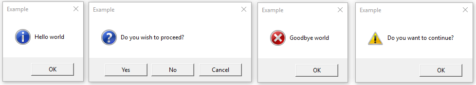

+++
title = "tkinter.messagebox --- Tkinter 消息提示"
date = 2024-11-15T20:56:44+08:00
weight = 40
type = "docs"
description = ""
isCJKLanguage = true
draft = false
+++

> 原文: [https://docs.python.org/zh-cn/3.13/library/tkinter.messagebox.html](https://docs.python.org/zh-cn/3.13/library/tkinter.messagebox.html)
>
> 收录该文档的时间：`2024-11-15T20:56:44+08:00`

# `tkinter.messagebox` --- Tkinter 消息提示

**源代码:** [Lib/tkinter/messagebox.py](https://github.com/python/cpython/tree/3.13/Lib/tkinter/messagebox.py)

------

​	The [`tkinter.messagebox`](https://docs.python.org/zh-cn/3.13/library/tkinter.messagebox.html#module-tkinter.messagebox) 模块提供了一个模板基类以及多个常用配置的便捷方法。 消息框为模式窗口并将基于用户的选择返回 (`True`, `False`, `None`, [`OK`](https://docs.python.org/zh-cn/3.13/library/tkinter.messagebox.html#tkinter.messagebox.OK), [`CANCEL`](https://docs.python.org/zh-cn/3.13/library/tkinter.messagebox.html#tkinter.messagebox.CANCEL), [`YES`](https://docs.python.org/zh-cn/3.13/library/tkinter.messagebox.html#tkinter.messagebox.YES), [`NO`](https://docs.python.org/zh-cn/3.13/library/tkinter.messagebox.html#tkinter.messagebox.NO)) 的一个子集。 常用消息框风格和布局包括但不限于：

## *class* tkinter.messagebox.**Message**(*master=None*, ***options*)

​	创建一个带有应用专属消息、图标和按钮组的消息窗口。 消息窗口中的每个按钮均以唯一符号名称进行标识（参见 *type* 选项）。

​	支持以下选项：

> ## *command*
>
> ​	指定当用户关闭对话框时要发起调用的函数。 用户关闭对话框所点击的按钮名称将作为参数传入。 此选项仅在 macOS 上可用。
>
> ## *default*
>
> ​	指定消息窗口默认按钮的 [符号名称](https://docs.python.org/zh-cn/3.13/library/tkinter.messagebox.html#messagebox-buttons) ([`OK`](https://docs.python.org/zh-cn/3.13/library/tkinter.messagebox.html#tkinter.messagebox.OK), [`CANCEL`](https://docs.python.org/zh-cn/3.13/library/tkinter.messagebox.html#tkinter.messagebox.CANCEL) 等等)。 如果未指定此选项，则对话框中的第一个按钮将成为默认。
>
> ## *detail*
>
> ​	为由 *message* 选项给出的主消息指定一条辅助消息。 消息详情将在主消息之下展示，并且在操作系统支持的情况下，会使用次于主消息的字体。
>
> ## *icon*
>
> ​	指定一个要显示的 [图标](https://docs.python.org/zh-cn/3.13/library/tkinter.messagebox.html#messagebox-icons)。 如果未指定此选项，则将显示 [`INFO`](https://docs.python.org/zh-cn/3.13/library/tkinter.messagebox.html#tkinter.messagebox.INFO) 图标。
>
> ## *message*
>
> ​	指定要在此消息框中显示的消息。 默认值为空字符串。
>
> ## *parent*
>
> ​	将指定的窗口设为该消息框的逻辑上级。 消息框将在其上级窗口之前显示。
>
> ## *title*
>
> ​	指定要作为消息框标题的字符串。 此选项在 macOS 上会被忽略，因为该平台的设计指导禁止在这种对话框中使用标题。
>
> ## *type*
>
> ​	安排显示一个 [预定义的按钮集合](https://docs.python.org/zh-cn/3.13/library/tkinter.messagebox.html#messagebox-types)。

## **show**(***options*)

​	显示一个消息窗口并等待用户选择某一个按钮。 然后返回所选择按钮的符号名称。 关键字参数可以覆盖在构造器中指定的选项。

**信息消息框**

## tkinter.messagebox.**showinfo**(*title=None*, *message=None*, ***options*)

​	创建并显示一个具有指定标题和消息的信息消息框。

**警告消息框**

## tkinter.messagebox.**showwarning**(*title=None*, *message=None*, ***options*)

​	创建并显示一个具有指定标题和消息的警告消息框。

## tkinter.messagebox.**showerror**(*title=None*, *message=None*, ***options*)

​	创建和显示一个具有指定标题和消息的错误消息框。

**疑问消息框**

## tkinter.messagebox.**askquestion**(*title=None*, *message=None*, ***, *type=YESNO*, ***options*)

​	提出一个问题。 在默认情况下显示 [`YES`](https://docs.python.org/zh-cn/3.13/library/tkinter.messagebox.html#tkinter.messagebox.YES) 和 [`NO`](https://docs.python.org/zh-cn/3.13/library/tkinter.messagebox.html#tkinter.messagebox.NO) 按钮。 返回所选择按钮的符号名称。

## tkinter.messagebox.**askokcancel**(*title=None*, *message=None*, ***options*)

​	询问操作是否要继续。 显示 [`OK`](https://docs.python.org/zh-cn/3.13/library/tkinter.messagebox.html#tkinter.messagebox.OK) 和 [`CANCEL`](https://docs.python.org/zh-cn/3.13/library/tkinter.messagebox.html#tkinter.messagebox.CANCEL) 按钮。 如果选择确定将返回 `True` 否则返回 `False`。

## tkinter.messagebox.**askretrycancel**(*title=None*, *message=None*, ***options*)

​	询问操作是否要重试。 显示 [`RETRY`](https://docs.python.org/zh-cn/3.13/library/tkinter.messagebox.html#tkinter.messagebox.RETRY) 和 [`CANCEL`](https://docs.python.org/zh-cn/3.13/library/tkinter.messagebox.html#tkinter.messagebox.CANCEL)。 如果选择重试将返回 `True` 否则返回 `False`。

## tkinter.messagebox.**askyesno**(*title=None*, *message=None*, ***options*)

​	提出一个问题。 显示 [`YES`](https://docs.python.org/zh-cn/3.13/library/tkinter.messagebox.html#tkinter.messagebox.YES) 和 [`NO`](https://docs.python.org/zh-cn/3.13/library/tkinter.messagebox.html#tkinter.messagebox.NO) 按钮。 如果选择是则返回 `True` 否则返回 `False`。

## tkinter.messagebox.**askyesnocancel**(*title=None*, *message=None*, ***options*)

​	提出一个问题。 显示 [`YES`](https://docs.python.org/zh-cn/3.13/library/tkinter.messagebox.html#tkinter.messagebox.YES), [`NO`](https://docs.python.org/zh-cn/3.13/library/tkinter.messagebox.html#tkinter.messagebox.NO) 和 [`CANCEL`](https://docs.python.org/zh-cn/3.13/library/tkinter.messagebox.html#tkinter.messagebox.CANCEL) 按钮。 如果选择是则返回 `True`，取消则返回 `None`，否则返回 `False`。

​	按钮的符号名称：

## tkinter.messagebox.**ABORT** *= 'abort'*

## tkinter.messagebox.**RETRY** *= 'retry'*

## tkinter.messagebox.**IGNORE** *= 'ignore'*

## tkinter.messagebox.**OK** *= 'ok'*

## tkinter.messagebox.**CANCEL** *= 'cancel'*

## tkinter.messagebox.**YES** *= 'yes'*

## tkinter.messagebox.**NO** *= 'no'*

​	预定义的按钮集合：

## tkinter.messagebox.**ABORTRETRYIGNORE** *= 'abortretryignore'*

​	显示符号名称为 [`ABORT`](https://docs.python.org/zh-cn/3.13/library/tkinter.messagebox.html#tkinter.messagebox.ABORT), [`RETRY`](https://docs.python.org/zh-cn/3.13/library/tkinter.messagebox.html#tkinter.messagebox.RETRY) 和 [`IGNORE`](https://docs.python.org/zh-cn/3.13/library/tkinter.messagebox.html#tkinter.messagebox.IGNORE) 的三个按钮。

## tkinter.messagebox.**OK** *= 'ok'*

​	显示符号名称为 [`OK`](https://docs.python.org/zh-cn/3.13/library/tkinter.messagebox.html#tkinter.messagebox.OK) 的一个按钮。

## tkinter.messagebox.**OKCANCEL** *= 'okcancel'*

​	显示符号名称为 [`OK`](https://docs.python.org/zh-cn/3.13/library/tkinter.messagebox.html#tkinter.messagebox.OK) 和 [`CANCEL`](https://docs.python.org/zh-cn/3.13/library/tkinter.messagebox.html#tkinter.messagebox.CANCEL) 的两个按钮。

## tkinter.messagebox.**RETRYCANCEL** *= 'retrycancel'*

​	显示符号名称为 [`RETRY`](https://docs.python.org/zh-cn/3.13/library/tkinter.messagebox.html#tkinter.messagebox.RETRY) 和 [`CANCEL`](https://docs.python.org/zh-cn/3.13/library/tkinter.messagebox.html#tkinter.messagebox.CANCEL) 的两个按钮。

## tkinter.messagebox.**YESNO** *= 'yesno'*

​	显示符号名称为 [`YES`](https://docs.python.org/zh-cn/3.13/library/tkinter.messagebox.html#tkinter.messagebox.YES) 和 [`NO`](https://docs.python.org/zh-cn/3.13/library/tkinter.messagebox.html#tkinter.messagebox.NO) 的两个按钮。

## tkinter.messagebox.**YESNOCANCEL** *= 'yesnocancel'*

​	显示符号名称为 [`YES`](https://docs.python.org/zh-cn/3.13/library/tkinter.messagebox.html#tkinter.messagebox.YES), [`NO`](https://docs.python.org/zh-cn/3.13/library/tkinter.messagebox.html#tkinter.messagebox.NO) 和 [`CANCEL`](https://docs.python.org/zh-cn/3.13/library/tkinter.messagebox.html#tkinter.messagebox.CANCEL) 的三个按钮。

​	图标图像：

## tkinter.messagebox.**ERROR** *= 'error'*

## tkinter.messagebox.**INFO** *= 'info'*

## tkinter.messagebox.**QUESTION** *= 'question'*

## tkinter.messagebox.**WARNING** *= 'warning'*
